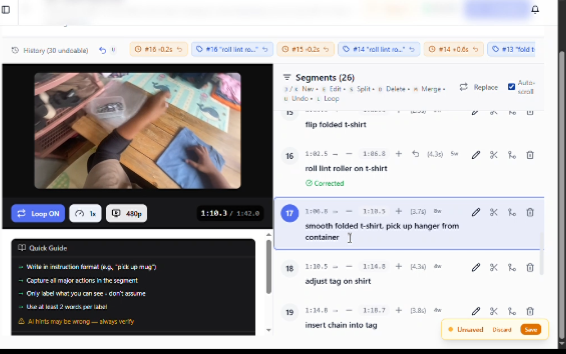

# # Video Annotation & AI Data Portfolio

## About Me

I am a detail-oriented AI data annotator with hands-on experience working with video annotation and temporal segmentation tasks. I have experience reviewing video content, identifying meaningful segments, assigning action labels, checking annotation boundaries, and reviewing corrections according to project guidelines.

My work involves careful visual analysis, consistency, attention to detail, and following structured annotation workflows to produce high-quality training data for AI systems.

## Video Annotation Experience

### Atlas — Video Annotation Project

I worked on a video annotation project involving the segmentation of video content into meaningful temporal intervals and labeling actions or events within each segment.

**Key activities included:**
- Reviewing video content and identifying meaningful temporal segments
- Assigning descriptive action labels to video segments
- Identifying appropriate segment start and end points
- Reviewing and correcting annotations
- Following project-specific annotation guidelines
- Maintaining consistency and accuracy across multiple video segments

**Annotation workflow:**

Video Review → Temporal Segmentation → Action Labeling → Quality Review → Correction

### Annotation Interface

The following screenshot shows an example of the video annotation interface used during the Atlas project.

## Shot Boundary Detection — Practice Project

As part of this portfolio, I am developing a practical example focused specifically on shot boundary detection and transition classification.

The exercise covers:

- Identifying shot start and end points
- Distinguishing cuts from camera movement
- Identifying fades and dissolves
- Recognizing other transition types
- Grouping related shots into scene buckets
- Classifying scenes by content category

This practice project demonstrates my understanding of the annotation principles relevant to video shot boundary detection.

## Sample Shot Card

| Shot | Start Time | End Time | Transition | Scene |
|------|------------|----------|------------|-------|
| 1 | 00:00 | 00:05 | Cut | Classroom |
| 2 | 00:05 | 00:12 | Cut | Classroom |
| 3 | 00:12 | 00:18 | Dissolve | Outdoor |

*The above is a portfolio practice example created for demonstration purposes.*

## Skills

- Video Annotation
- Temporal Segmentation
- Action Labeling
- Shot Boundary Detection
- Transition Classification
- Scene Classification
- Annotation Quality Review
- Attention to Detail
- Following Annotation Guidelines
- AI Training Data Preparation

## Tools

- Atlas annotation interface
- CVAT / video annotation workflows
- CapCut
- InVideo
- Powtoon
- OpenToonz

## Portfolio Objective

This portfolio demonstrates my practical experience with video annotation and my ability to apply structured visual analysis to AI training data tasks.
